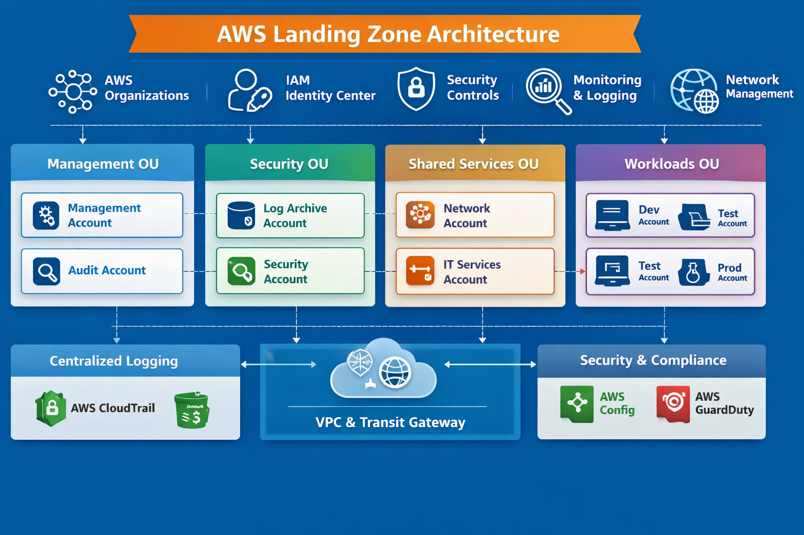

An AWS Landing Zone is a well‑architected, secure, multi‑account AWS environment that provides the foundational structure, governance, and guardrails for scaling workloads. It defines account hierarchy, identity management, logging, networking, and security controls, serving as the blueprint for enterprise cloud adoption.

Following is visual diagram for AWS Landing Zone:
