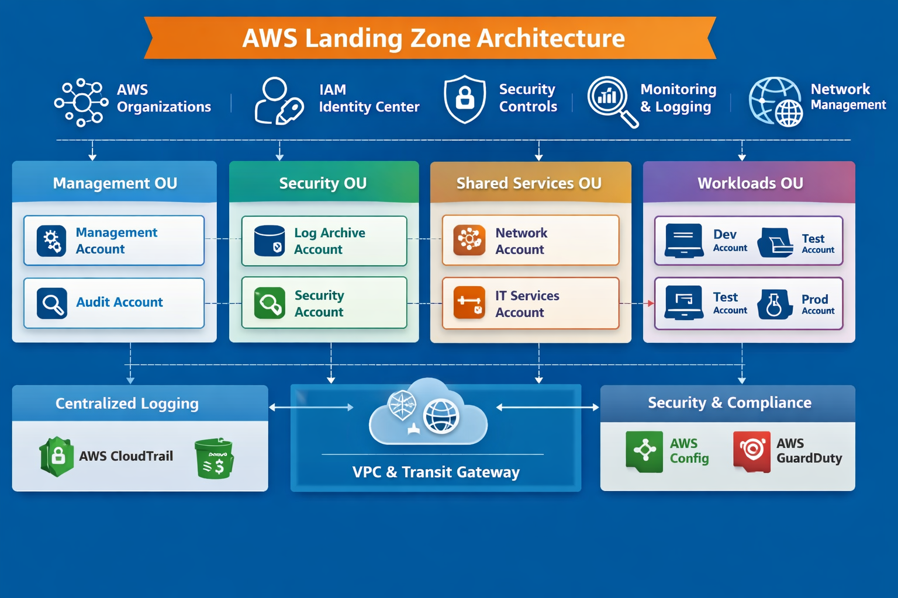
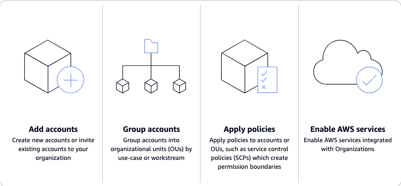

An AWS Landing Zone is a well‑architected, secure, multi‑account AWS environment that provides the foundational structure, governance, and guardrails for scaling workloads. It defines account hierarchy, identity management, logging, networking, and security controls, serving as the blueprint for enterprise cloud adoption.

Following is visual diagram for AWS Landing Zone:

## Key Concepts for AWS Landing Zone Deployment

### AWS Organizations: 
AWS Organizations provides centralized account management with organizational units (OUs) to group accounts by function, environment, or team.

It helps to manage and govern AWS Account as you scale your AWS environment.
Following are the use cases of AWS Organizations:
- Automate the creation of AWS accounts and categorize workloads
- Define and enforce audit and compliance policies
- Provide tools and access for your Security teams while encouraging development
- Share common resources across accounts
- Share critical central resources across your accounts

### AWS Control Tower:
AWS Control Tower offers a prescriptive approach to setting up and governing a secure, multi-account AWS environment based on AWS best practices.

### AWS Service Catalog:
AWS Service Catalog allows organizations to create and manage approved catalogs of resources that are available for use on AWS, ensuring compliance and governance.

### AWS Identity and Access Management (IAM):
AWS IAM enables fine-grained access control to AWS services and resources, allowing organizations to implement the principle of least privilege.

### AWS CloudTrail:
AWS CloudTrail provides governance, compliance, and operational and risk auditing of your AWS account by logging all API calls.

### AWS Config:
AWS Config enables you to assess, audit, and evaluate the configurations of your AWS resources, helping to ensure compliance with internal policies and regulatory standards.

### AWS CloudFormation:
AWS CloudFormation allows you to model and provision AWS resources using infrastructure as code (IaC), enabling consistent and repeatable deployments.

### AWS Organizations:
AWS Organizations provides centralized account management with organizational units (OUs) to group accounts by function, environment, or team.