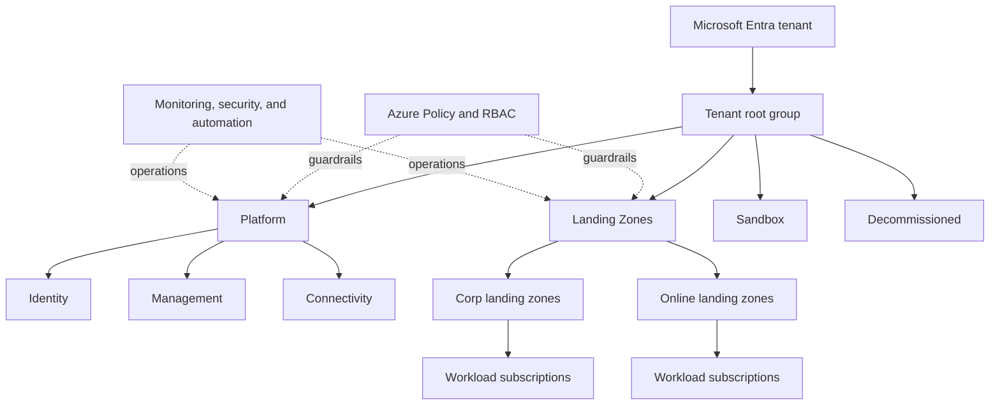

# Azure Landing Zone and Cloud Adoption Framework (CAF)

An **Azure landing zone** is a scalable and governed Azure environment prepared for hosting workloads. It provides the foundational structure for identity, subscription organization, networking, security, management, governance, and deployment automation.

The **Microsoft Cloud Adoption Framework for Azure (CAF)** is broader. It provides guidance for the complete cloud adoption journey, while Azure landing zones are the recommended implementation approach for the **Ready** methodology of CAF.

In simple terms:

- CAF explains **how an organization should adopt and operate Azure**.
- An Azure landing zone provides **the Azure environment in which workloads run**.

## Azure Landing Zone Conceptual Architecture



This structure separates shared platform services from application workloads. Each workload normally receives one or more subscriptions, while policies inherited through management groups establish consistent guardrails.

## Microsoft Cloud Adoption Framework

CAF organizes cloud adoption into connected methodologies:

### Strategy

Define business motivations, expected outcomes, financial considerations, and the reasons for moving to Azure.

### Plan

Assess the digital estate, identify skill gaps, prioritize workloads, and create an actionable cloud adoption plan.

### Ready

Prepare the Azure environment for adoption. This is where Azure landing zones are designed and deployed.

### Adopt

Migrate existing workloads or build cloud-native solutions in Azure. The Adopt methodology includes both **migrate** and **innovate** scenarios.

### Govern

Establish policies and processes for cost management, security baselines, resource consistency, identity, and regulatory compliance.

### Secure

Continuously reduce risk by protecting identities, applications, data, infrastructure, and networks.

### Manage

Operate workloads reliably through monitoring, resilience, support processes, performance management, and continuous improvement.

CAF is iterative rather than a one-time sequence. Governance, security, and management mature as the Azure estate and business requirements grow.

## Key Azure Landing Zone Design Areas

### Billing and Microsoft Entra Tenant

The Microsoft Entra tenant is the identity boundary for an Azure environment. Billing agreements, tenant ownership, and subscription creation should be established before workloads are onboarded.

### Identity and Access Management

Microsoft Entra ID provides centralized authentication. Azure role-based access control (RBAC), managed identities, privileged identity management, conditional access, and least-privilege assignments control access to resources.

### Resource Organization

Azure resources are organized into four principal scopes:

```text
Management groups
└── Subscriptions
    └── Resource groups
        └── Resources
```

Management groups provide governance at scale. Subscriptions act as governance, billing, and deployment boundaries. Resource groups contain resources that share a lifecycle.

### Network Topology and Connectivity

The platform team provides shared connectivity by using an architecture such as hub-and-spoke or Azure Virtual WAN. Typical components include Azure Firewall, VPN Gateway, ExpressRoute, private DNS, DDoS protection, and private endpoints.

The **Connectivity** subscription commonly hosts shared network resources, while application subscriptions host workload virtual networks.

### Security

Microsoft Defender for Cloud helps assess security posture and protect workloads. Security controls should also include centralized logging, network segmentation, encryption, secrets management with Azure Key Vault, and incident response integration.

### Management

Azure Monitor, Log Analytics workspaces, Application Insights, alerts, and automation provide a common operational baseline. Diagnostic settings should send relevant platform and workload logs to centralized monitoring destinations.

### Governance

Azure Policy defines and enforces guardrails such as allowed regions, required tags, secure configurations, diagnostic settings, and restrictions on public access. Policy initiatives group related policies into standards that can be assigned at management-group or subscription scope.

Policies should favor effects such as `Audit`, `Deny`, `Modify`, and `DeployIfNotExists` according to the risk and remediation strategy.

### Platform Automation and DevOps

Landing-zone resources and policies should be deployed through infrastructure as code, commonly with Bicep or Terraform. Version-controlled pipelines make platform changes reviewable, repeatable, and traceable.

Microsoft provides the **Azure Landing Zone accelerator** as a reference implementation that can be tailored to organizational requirements.

## Common Management Group Structure

| Management group | Purpose |
| --- | --- |
| Platform | Parent for shared platform services |
| Identity | Identity-related shared services, when required |
| Management | Monitoring, operations, and automation services |
| Connectivity | Central networking and connectivity services |
| Landing Zones | Parent for workload subscriptions |
| Corp | Internal or hybrid workloads requiring corporate connectivity |
| Online | Internet-facing or isolated online workloads |
| Sandbox | Experimentation with less restrictive controls and cost limits |
| Decommissioned | Disabled or retired subscriptions awaiting removal |

This hierarchy is a starting point, not a mandatory organization chart. Management groups should primarily reflect governance requirements, not mirror departments too closely.

## Platform Landing Zone and Application Landing Zones

### Platform Landing Zone

The platform landing zone contains shared services used across the organization, such as connectivity, identity-related infrastructure, monitoring, policy, and security tooling. A central platform team usually owns it.

### Application Landing Zone

An application landing zone is one or more subscriptions provisioned for a workload or application team. It inherits organizational guardrails while allowing the workload team to deploy and operate its own resources.

Application landing zones may be:

- **Centrally managed**, where the platform team manages more of the workload environment.
- **Application-team managed**, where product teams receive greater autonomy within policy guardrails.

## Typical Deployment Flow

1. Define business, compliance, security, and data-residency requirements.
2. Confirm the Microsoft Entra tenant and billing model.
3. Design management groups and subscription placement.
4. Deploy platform subscriptions for management, connectivity, and identity services as needed.
5. Assign Azure Policy initiatives and RBAC roles at the correct scopes.
6. Configure centralized networking, security, logging, and monitoring.
7. Automate application landing-zone subscription vending.
8. Onboard workloads and continuously improve the platform through CAF governance and management practices.

## Key Principles

- Use subscriptions as workload and governance boundaries.
- Apply guardrails through policy inheritance instead of configuring every resource manually.
- Separate platform services from application workloads.
- Prefer managed identities and least-privilege access.
- Treat the landing zone as a product that evolves over time.
- Automate deployments and changes through version-controlled infrastructure as code.
- Give application teams autonomy inside clearly defined security and governance boundaries.

## References

- [Microsoft Cloud Adoption Framework for Azure](https://learn.microsoft.com/azure/cloud-adoption-framework/overview)
- [What is an Azure landing zone?](https://learn.microsoft.com/azure/cloud-adoption-framework/ready/landing-zone/)
- [Azure landing zone design areas](https://learn.microsoft.com/azure/cloud-adoption-framework/ready/landing-zone/design-areas)
- [Azure landing zone conceptual architecture](https://learn.microsoft.com/azure/cloud-adoption-framework/ready/landing-zone/conceptual-architecture)
- [Azure landing zone implementation options](https://learn.microsoft.com/azure/cloud-adoption-framework/ready/landing-zone/implementation-options)
