# How Modern AI Actually Works: From Words to Autonomous Agents

## Introduction

If you have worked in Cloud, Infrastructure, DevOps, or Platform Engineering, you've probably encountered terms such as:

* LLM
* Tokens
* Embeddings
* Vector Database
* RAG
* MCP
* Tool Calling
* AI Agents

Most articles explain these concepts individually, but very few explain how they work together as a complete system.

This often leads to confusion:

* Does an LLM store knowledge in a Vector Database?
* Are embeddings created every time a prompt is sent?
* What is the difference between RAG and MCP?
* How do AI Agents fit into the picture?
* Why do we need both LLMs and external tools?

This article explains these concepts from a Cloud Architect's perspective and shows how a modern enterprise AI solution is built.

By the end, you'll understand the complete flow from a user question to an autonomous AI agent performing actions across enterprise systems.

---

## A Running Example

Throughout this article, we'll use a practical enterprise scenario.

A Cloud Operations Engineer asks:

> Show me all AWS EC2 instances that do not have backups enabled and create Jira tickets for the application owners.

This simple request will help us understand every major AI concept.

---

## How AI Understands Language

Humans understand words directly.

When we read:

> "Show EC2 instances without backups"

our brain instantly understands the intent.

AI models work differently.

Before an AI model can reason about language, it must convert text into a numerical form.

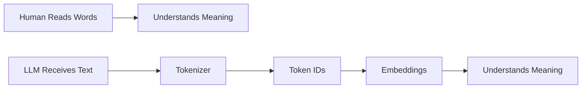

The journey begins with Tokens.

---

## Tokens: The Language of AI

A Large Language Model does not understand words.

Instead, it understands tokens.

Consider the prompt:

```text
Show EC2 instances without backups
```

The tokenizer may convert it into:

```text
[125, 982, 456, 321, 778]
```

These numbers are Token IDs.

Think of tokens as dictionary references.

Important:

Tokens contain no meaning.

They simply identify pieces of text.

A token can represent:

* A complete word
* Part of a word
* A punctuation mark
* A special symbol

The exact tokenization depends on the model.

---

## Embeddings: Giving Meaning to Tokens

If tokens are merely identifiers, how does an AI understand meaning?

This is where embeddings come in.

An embedding is a mathematical representation of meaning.

For example:

```text
Server  -> [0.23, 0.87, 0.44 ...]
VM      -> [0.25, 0.85, 0.42 ...]
Pizza   -> [0.91, 0.11, 0.05 ...]
```

Notice how Server and VM are closer together than Server and Pizza.

Embeddings allow AI to understand relationships.

A simple way to remember:

| Concept   | Purpose  |
| --------- | -------- |
| Token     | Identity |
| Embedding | Meaning  |

---

## What Happens When You Call an LLM?

This is one of the most misunderstood areas of AI.

Many people assume that embeddings are stored in a Vector Database every time a prompt is sent.

That is not what happens.

When a prompt reaches the LLM:

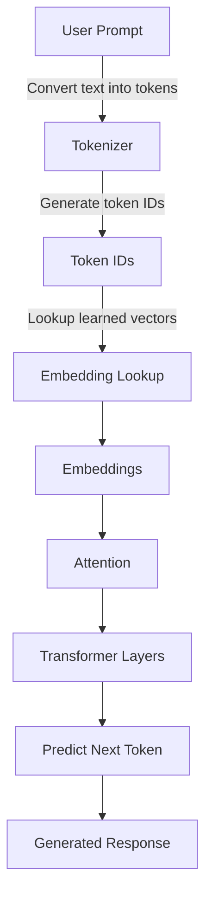

Notice the term:

**Embedding Lookup**

The embeddings already exist inside the trained model.

The model is not creating new embeddings for your prompt.

Instead, it is looking up embeddings learned during training.

This distinction becomes important when we discuss RAG.

---

## Attention: The Secret Behind Modern AI

One of the biggest breakthroughs in AI was the invention of the Attention Mechanism.

Suppose the model is reading:

> The server crashed because it ran out of memory.

To understand "memory", some words are more important than others.

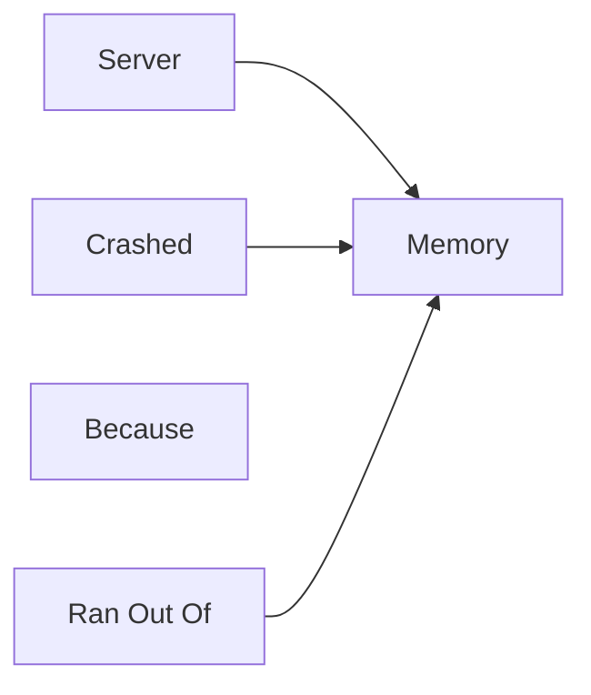

The model learns which words deserve more attention.

This enables:

* Context awareness
* Long conversations
* Code generation
* Document understanding
* Complex reasoning

Without Attention, modern LLMs would not exist.

---

## Transformers: The Engine Behind LLMs

Attention is the core building block of a Transformer.

Every major LLM today uses Transformer architecture.

Examples:

* GPT
* Claude
* Gemini
* Llama
* Mistral

A Transformer is essentially multiple layers of attention and reasoning stacked together.

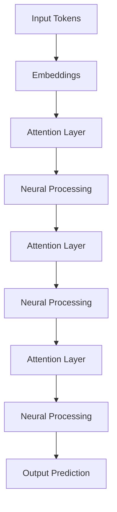

The deeper the stack, the more sophisticated the model's reasoning capabilities become.

---

## Where Does an LLM Store Knowledge?

A common misconception is:

> LLMs store information in a Vector Database.

This is incorrect.

During training:

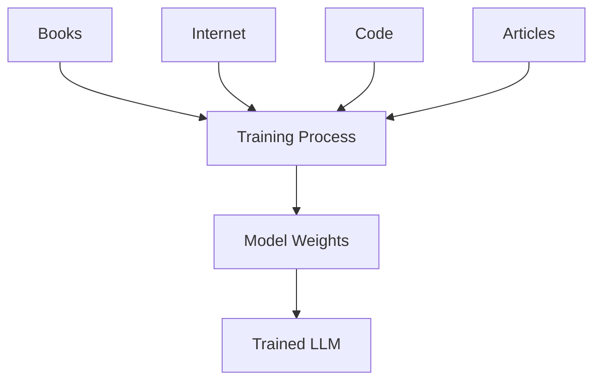

The model learns patterns from massive datasets.

That knowledge becomes encoded in:

**Model Weights**

not in a Vector Database.

---

## The Limitation of LLMs

Imagine your company has:

* Internal PDFs
* SharePoint documents
* Confluence pages
* Service Catalog documentation
* Runbooks

The LLM was never trained on these documents.

Therefore, it cannot answer questions about them.

This is where RAG becomes valuable.

---

## RAG: Giving LLMs Access to Enterprise Knowledge

RAG stands for Retrieval Augmented Generation.

Instead of retraining the LLM, we provide additional information at runtime.

First, enterprise documents are processed.

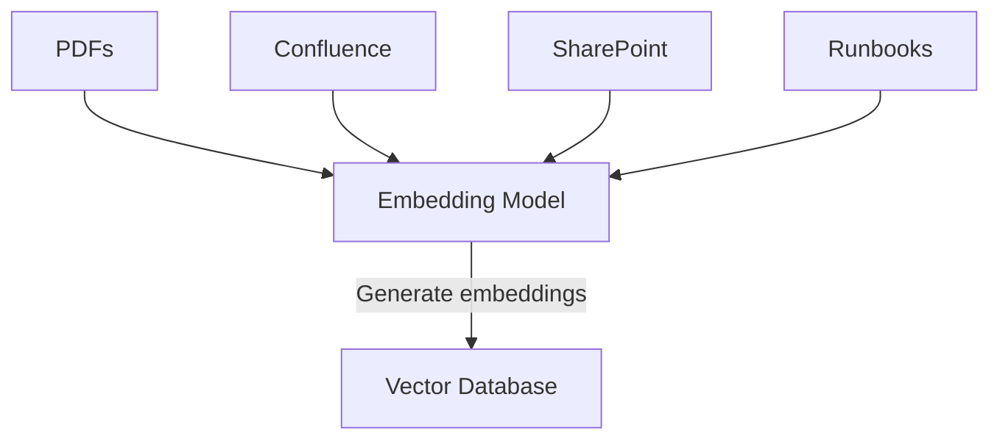

Unlike LLM inference, new embeddings are created here.

These embeddings are stored in a Vector Database.

---

## How RAG Answers Questions

Now imagine the user asks:

> What is the approved backup schedule for production EC2 instances?

The system performs:

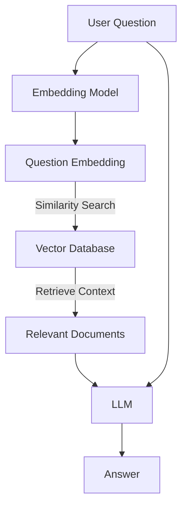

The retrieved documents are added to the prompt before the LLM generates an answer.

Think of RAG as:

> Giving the LLM an open-book exam instead of a closed-book exam.

---

## Why RAG Is Not Enough

Now let's return to our original request:

> Show me all AWS EC2 instances without backups enabled and create Jira tickets.

RAG can search documents.

But RAG cannot:

* Query AWS
* Create Jira tickets
* Update ServiceNow
* Restart Kubernetes Pods

These require actions.

This is where MCP comes in.

---

## MCP: The Universal Adapter for AI

MCP stands for Model Context Protocol.

A useful analogy is:

> USB-C standardized how devices connect.

MCP standardizes how AI systems connect to tools.

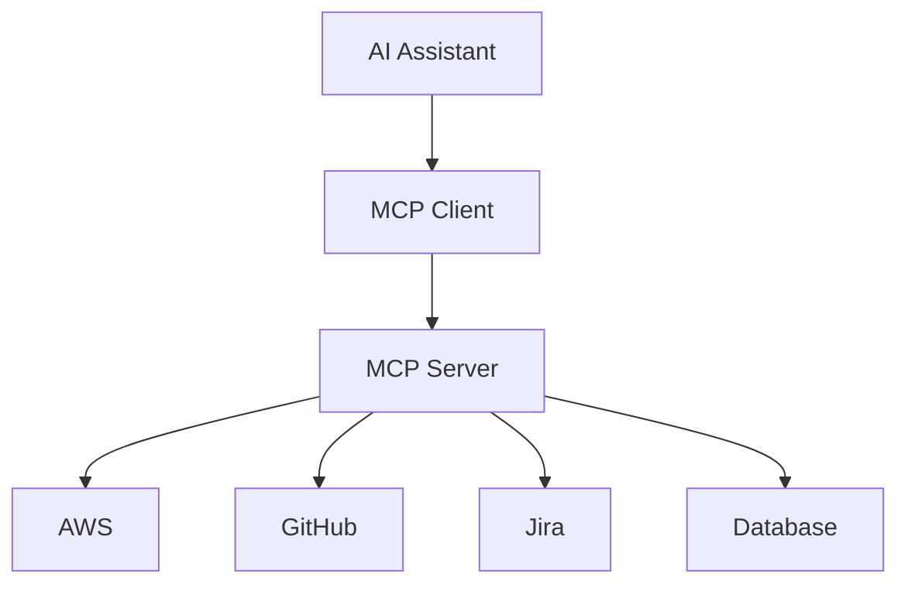

MCP allows an AI system to interact with external systems using a common protocol.

---

## RAG vs MCP

Many newcomers confuse these two concepts.

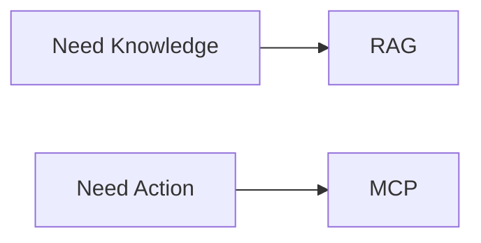

Use RAG when:

* Searching documents
* Searching policies
* Searching knowledge bases

Use MCP when:

* Querying AWS
* Creating Jira tickets
* Accessing databases
* Executing actions

---

## AI Agents: Bringing Everything Together

An LLM answers questions.

An Agent accomplishes goals.

Consider again:

> Show EC2 instances without backups and create Jira tickets.

The Agent might:

1. Access AWS
2. Retrieve EC2 information
3. Check backup compliance
4. Search internal policy documents
5. Generate recommendations
6. Create Jira tickets
7. Return a summary

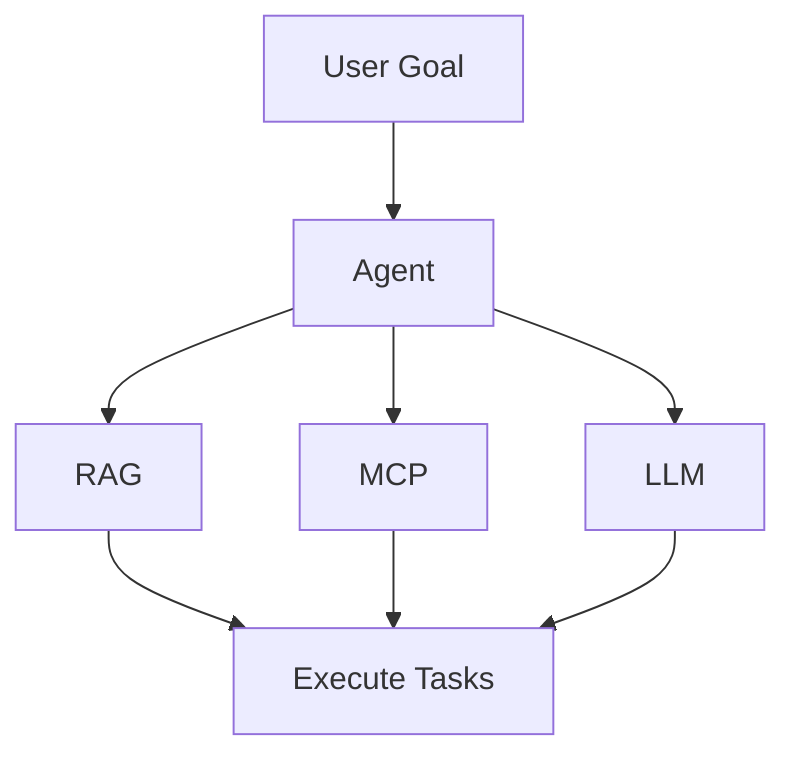

The Agent acts as the orchestrator.

---

## End-to-End Enterprise AI Architecture

The complete architecture now looks like this:

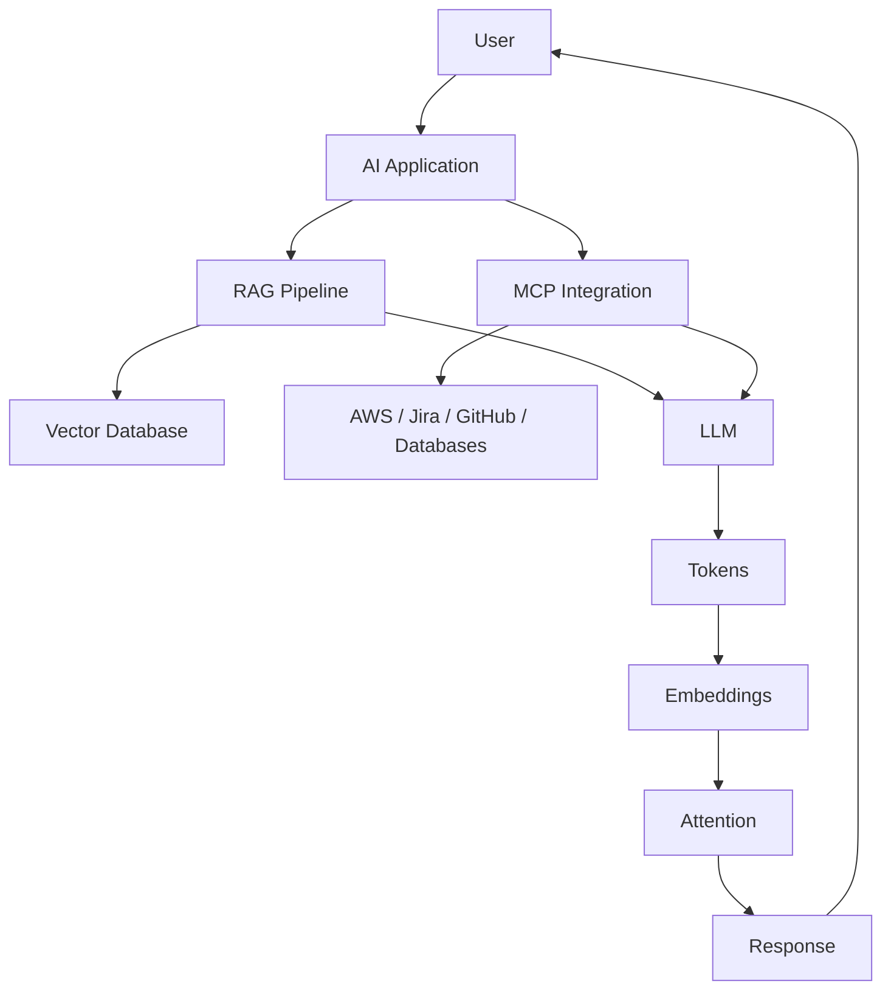

---

## Key Takeaways

If you remember only five things from this article, remember these:

1. Tokens are identifiers; embeddings represent meaning.

2. During normal LLM inference, embeddings are looked up from the trained model and are not stored in a Vector Database.

3. Vector Databases are primarily used by RAG systems to store and search document embeddings.

4. RAG provides knowledge, while MCP provides actions and live system access.

5. AI Agents combine LLMs, RAG, MCP, and workflows to accomplish real business goals.

Modern enterprise AI solutions are not just LLMs. They are intelligent systems that combine reasoning, knowledge retrieval, tool access, and orchestration to automate increasingly complex tasks across cloud and enterprise platforms.
