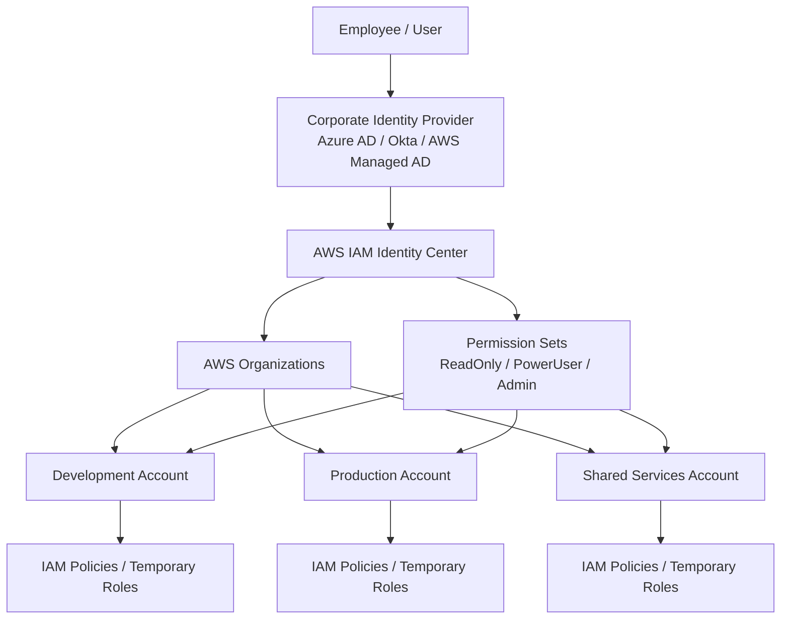
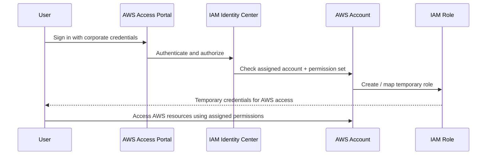
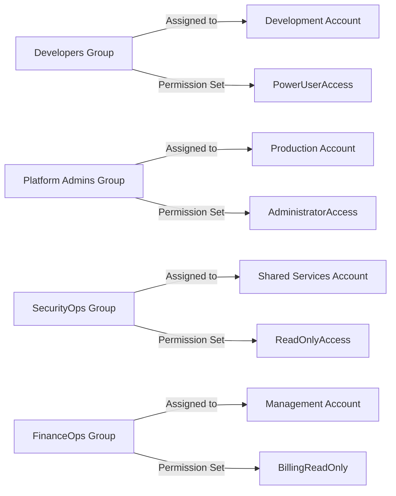

# AWS IAM Identity Center

AWS IAM Identity Center (formerly AWS Single Sign-On or AWS SSO) is an AWS service that helps organizations manage access to multiple AWS accounts and business applications with one centralized identity system.

In simple terms, it lets users sign in once and then access the right AWS accounts, applications, and roles without creating separate IAM users in every account.

---

## Why it exists: the problem it solves

As organizations grow, they often end up with:

- multiple AWS accounts (dev, test, prod, shared services, sandbox)
- many teams and business units
- multiple applications outside AWS
- users who need different access levels in different accounts

Without a central identity layer, each account must manage its own IAM users, groups, policies, and access assignments. This creates:

- duplicated user management
- inconsistent permissions across accounts
- difficult onboarding and offboarding
- weak governance and audit visibility
- more security risk from shared or stale access

IAM Identity Center solves this by providing a centralized identity and access control layer for AWS organizations.

It is especially useful for enterprises that need single sign-on (SSO), centralized user provisioning, and consistent access across many AWS accounts.

---

## How it is better than normal IAM

Normal IAM is still essential, but it is designed mainly for managing permissions inside a single AWS account.

### IAM alone is good for:

- granting access to resources inside one account
- creating users, roles, and policies
- managing EC2, S3, Lambda, and other AWS resource permissions

### IAM Identity Center is better when:

- many AWS accounts exist under one organization
- users need access to several accounts with different roles
- organizations want centralized access management
- users should authenticate with corporate identity providers
- business teams need SSO with MFA and approved access patterns

### In short

- IAM manages access inside an account.
- IAM Identity Center manages access across multiple accounts and apps from one place.

---

## Where IAM Identity Center is better than IAM

IAM Identity Center is stronger in these scenarios:

### 1. Multi-account access

A user may need to operate in development, staging, and production accounts. With IAM Identity Center, access is assigned centrally, and the user gets the appropriate role in each account.

### 2. Centralized user lifecycle

When a new employee joins, the IT or security team can assign them to the correct group once, and the right permissions are granted automatically through the business process and identity provider.

### 3. Single sign-on

Users log in once through a corporate identity provider or AWS-managed directory and then access multiple AWS accounts and AWS business apps without managing many separate credentials.

### 4. Stronger governance

Security teams can assign permission sets and monitor who has access to which AWS accounts. This reduces privilege sprawl and makes auditing easier.

### 5. Federation with enterprise IdPs

IAM Identity Center integrates with Microsoft Entra ID (formerly Azure AD), Okta, Google Workspace, and AWS Directory Service, so organizations can leverage existing identity investments instead of creating many AWS-only accounts.

---

## How it supports IAM

IAM Identity Center does not replace IAM; it complements it.

Here is the relationship:

- IAM Identity Center authenticates the user and gives them access to AWS accounts.
- It creates temporary IAM roles in the target AWS account.
- Those IAM roles then use standard IAM policies to define permissions.

### Example

A user signs in using IAM Identity Center. Their group is assigned a permission set like `ReadOnlyAccess` for the Production account.

IAM Identity Center creates or maps an IAM role in that account, such as:

- `AWSReservedSSO_ReadOnlyAccess_...`

This role is then used by the user through temporary credentials. The underlying access is still governed by IAM policies.

So the model is:

- Identity Center = centralized SSO and access administration
- IAM = actual permission enforcement in each AWS account

This is a very important concept: IAM Identity Center is an access administration layer built on top of IAM.

---

## Benefits of using IAM Identity Center

### 1. Faster onboarding and offboarding

Add a user to a group once and assign them to accounts and permission sets. Remove them when they leave the organization.

### 2. Reduced operational complexity

No need to create multiple IAM users across many AWS accounts or manage separate passwords for each environment.

### 3. Better access control

Use permission sets to grant only the required access for each role, following the principle of least privilege.

### 4. Centralized governance

Security teams can enforce standard access models across AWS accounts, applications, and teams.

### 5. Stronger security with MFA and federation

Users can authenticate through a trusted identity provider and enforce MFA centrally.

### 6. Improved auditing and compliance

Access becomes easier to track and review through centralized assignments and AWS account-level logs.

### 7. Cross-account consistency

All accounts can follow the same access model, improving consistency for developers, operations, and support teams.

---

## Best practices for secure authentication

### 1. Use an external identity provider

Prefer Microsoft Entra ID, Okta, or another enterprise IdP instead of managing access completely in AWS.

### 2. Enforce MFA everywhere

Require multi-factor authentication for all users, especially for privileged roles and production access.

### 3. Follow least privilege

Create narrowly scoped permission sets such as `BillingReadOnly`, `DeveloperPowerUser`, or `DBAdmin` instead of broad admin access.

### 4. Separate administrative roles

Use different groups and roles for:

- security administrators
- platform engineers
- developers
- support engineers
- auditors

### 5. Keep access review regular

Review group membership and account assignments quarterly or more often for privileged users.

### 6. Use temporary credentials

IAM Identity Center maps users to roles using temporary security credentials instead of long-lived IAM user keys where possible.

### 7. Restrict high-risk access

Production and security accounts should require stronger approval and MFA controls than lower-risk sandbox accounts.

### 8. Use AWS Organizations with clear account structure

Arranging accounts by environment and team makes permission sets cleaner and reduces errors.

---

## Key concepts in IAM Identity Center

### Identity source

This is where user identities come from:

- AWS IAM Identity Center built-in identity store
- Microsoft Entra ID
- Okta
- Google Workspace
- AWS Managed Microsoft AD

### Users

A person or service identity that is part of the identity source.

### Groups

A collection of users who share common access needs. For example:

- Developers
- PlatformAdmins
- SecurityOps
- FinanceOps

### Accounts

AWS accounts that are managed under AWS Organizations and to which users need access.

### Permission sets

A permission set is a bundle of IAM policies that define what the user can do in an AWS account.

Examples:

- `AdministratorAccess`
- `ReadOnlyAccess`
- `PowerUserAccess`
- `BillingReadOnly`
- `EC2Developer`

### Account assignments

This maps a user or group to:

- an AWS account
- a permission set

This is the main access model used in Identity Center.

### Session duration

IAM Identity Center can configure how long a user can remain signed into an AWS session before re-authentication is required.

### User portal

Users access AWS with a centralized portal such as:

- AWS access portal
- corporate SSO login page

---

## How to enable IAM Identity Center

The general flow is straightforward:

1. Enable IAM Identity Center in the AWS Organizations management account.
2. Choose an identity source.
3. Configure your directory or connect your external IdP.
4. Create groups and users.
5. Add AWS accounts from the organization.
6. Create permission sets.
7. Assign users and groups to accounts and permission sets.
8. Require MFA and review access.
9. Share the AWS access portal URL with users.

### Typical AWS console flow

- Go to AWS IAM Identity Center
- Choose the identity source
- Set up AWS access portal
- Create groups
- Add users
- Add accounts from AWS Organizations
- Add permission sets
- Assign groups to accounts
- Test login and permissions

---

## Simple example: users, groups, permission sets, and accounts

Imagine a company has the following AWS accounts:

- Management Account
- Development Account
- Production Account
- Shared Services Account

The company has the following team structure:

- Platform Admins
- Developers
- Security Operations
- Billing Read-Only

### Example permission sets

- `AdministratorAccess` — full access to selected accounts
- `PowerUserAccess` — deploy services, read and write resources
- `ReadOnlyAccess` — read-only access to infrastructure
- `BillingReadOnly` — view billing and cost information

### Example assignments

- `PlatformAdmins` -> Production Account -> `AdministratorAccess`
- `Developers` -> Development Account -> `PowerUserAccess`
- `SecurityOps` -> Shared Services Account -> `ReadOnlyAccess`
- `BillingReadOnly` -> Management Account -> `BillingReadOnly`

### Example user model

- Alice is a Platform Admin
- Bob is a Developer
- Carol is a Security Analyst
- Dave is a Finance Manager

This allows each user to access only the accounts and permissions they need.

---

## Mermaid example 1: architecture overview

This diagram shows the core pattern: identity is centralized, permissions are assigned centrally, and actual AWS enforcement still happens through IAM roles and policies.

---

## Mermaid example 2: user access flow

This sequence shows how the login process works in a clean, practical way.

---

## Mermaid example 3: simple account assignment model

This is a common enterprise pattern: account access is assigned by group, while permission sets define the exact level of access.

---

## Practical example: permission set design

### Development team

- assigned to Development account
- permission set: `PowerUserAccess`
- can create and manage resources in dev but not in production

### Production operators

- assigned to Production account
- permission set: `AdministratorAccess`
- access is restricted to authorized administrators only

### Security team

- assigned to Shared Services account
- permission set: `ReadOnlyAccess`
- monitors infrastructure without changing it

### Finance team

- assigned to Management account
- permission set: `BillingReadOnly`
- sees cost and billing data only

---

## Summary

AWS IAM Identity Center is a centralized access management service for multi-account AWS environments. It helps organizations provide secure, consistent, and scalable access to AWS accounts and business applications without managing access in every account separately.

It is especially valuable when:

- the organization has many AWS accounts
- users need SSO across multiple accounts
- the company already uses an enterprise identity provider
- security teams need centralized control and auditing

Think of IAM as the permission engine inside each AWS account, and IAM Identity Center as the centralized control plane for who can access which AWS account and with what permission set.

That combination gives organizations the best balance of:

- governance
- security
- productivity
- simplified identity management

---

## Final takeaway

If your organization is scaling to multiple AWS accounts, IAM Identity Center is one of the most practical ways to move from fragmented IAM management to centralized access control. It reduces risk, improves governance, and makes AWS access easier for both administrators and end users.
