# AWS Networking Inside a Single Account

This guide explains how networking is typically set up in AWS when you are working within a single AWS account. It focuses only on a single-account and single-VPC view, not on cross-account networking, centralized transit architecture, or enterprise hub-and-spoke patterns across multiple AWS accounts.

If you are new to AWS, the easiest way to think about it is this:

- an AWS account is your billing and resource boundary
- a VPC is the main private network inside that account
- subnets divide the VPC into smaller sections
- security groups and NACLs control what traffic is allowed
- route tables decide how traffic moves

---

## 1. The big picture

Inside one AWS account, you usually run services such as EC2 instances, RDS databases, load balancers, and Lambda-based components. These resources need to communicate with each other and sometimes with the internet.

AWS networking gives you the building blocks to define:

- which resources are private and which are public
- which ports are open
- which traffic is allowed or blocked
- how traffic routes inside the account

### Simple mental model

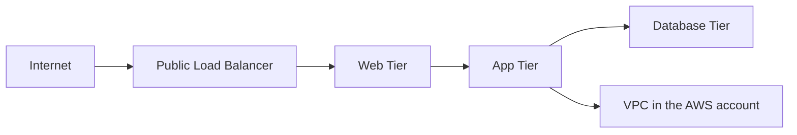

In a simple AWS account setup, the VPC is the core private network. Inside it, you create subnets and security controls so web, app, and database layers are separated logically and securely.

---

## 2. What is an AWS account in this context?

An AWS account is a container for AWS resources. It provides billing, identity, and service isolation. For this guide, we will focus only on networking inside one account:

- one account
- one or more VPCs inside it
- resources connected in that account
- no cross-account networking or centralized control-plane design discussed here

This is the simplest starting point for understanding AWS networking.

---

## 3. The main networking building blocks

The common components you will see in a single account are:

### VPC
A VPC is a virtual private cloud. It is the main private network in an AWS account.

### Subnet
A subnet is a smaller section inside a VPC. It helps you group resources by function.

### Internet Gateway (IGW)
An Internet Gateway lets a VPC communicate with the public internet.

### NAT Gateway / NAT Instance
This allows private resources to access the internet without exposing themselves directly.

### Security Group
A security group acts as a virtual firewall for EC2 instances and other resources.

### Network Access Control List (NACL)
A NACL is a subnet-level firewall that applies rules to all traffic entering or leaving a subnet.

### Route Table
A route table tells traffic where to go. It defines the path for traffic leaving the subnet.

### Elastic Load Balancer (ELB)
A load balancer distributes incoming traffic across multiple EC2 instances.

### VPC Endpoints
These let AWS services be accessed privately without using the public internet.

### Flow Logs
These capture network traffic logs for troubleshooting, monitoring, and security review.

---

## 4. Virtual Private Cloud (VPC)

A VPC is the foundation of AWS networking. It is essentially your private network inside AWS.

### What it does

- holds resources in private IP space
- lets them communicate privately inside the account
- creates an isolated environment for your workloads

### Why it matters

Without a VPC, resources do not have a private network boundary in which to communicate securely.

### Example

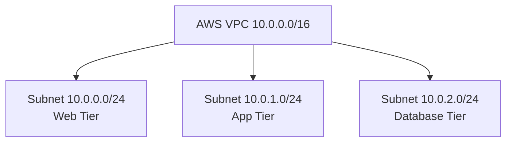

This is a common pattern: one VPC, multiple subnets, each used for a different layer of the application.

### VPC design principles

- allocate private address ranges carefully
- avoid overlapping with other networks
- keep the network clear and predictable
- separate workloads by purpose and risk

---

## 5. Subnets

A subnet is a smaller network inside a VPC.

Why subnets are important:

- isolate application components
- apply different rules per segment
- control which workloads can be internet-facing
- help you organize dev, test, and production environments

### Example subnet layout

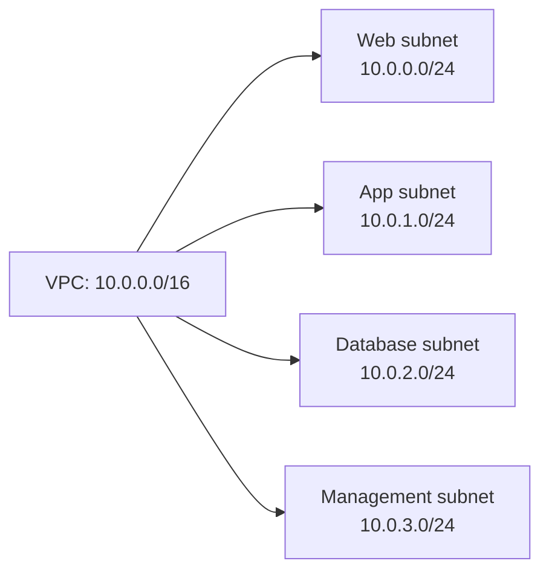

### Common patterns

- Web subnet for public-facing workloads
- App subnet for business logic
- DB subnet for data layers
- Management subnet for bastion or admin access

Each subnet can have different security rules and routing behavior.

---

## 6. IP address planning

Every resource in a subnet gets an IP address.

AWS usually uses private address ranges such as:

- `10.0.0.0/8`
- `172.16.0.0/12`
- `192.168.0.0/16`

### Example

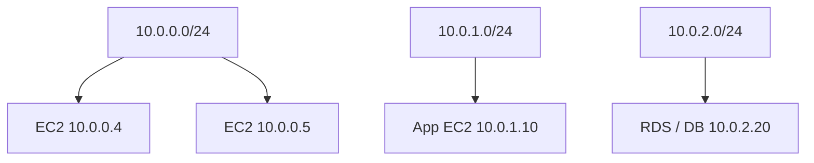

### Key considerations

- avoid overlapping ranges
- reserve space for future growth
- plan for load balancers, NAT gateways, and bastions
- keep private address ranges consistent with your architecture

---

## 7. Internet access and NAT

Not every resource in a VPC needs to be reachable from the internet.

### Internet Gateway (IGW)
An Internet Gateway allows a VPC to connect to the internet.

It is used for:

- public subnets
- public-facing application load balancers
- public web servers

### NAT Gateway
A NAT Gateway allows private subnets to reach the internet without exposing themselves to inbound internet traffic.

This is ideal for:

- private app servers updating packages
- private workloads reaching external services
- outbound-only internet access

### Example

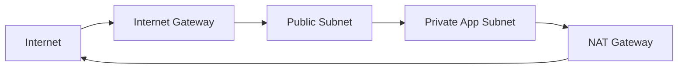

This pattern keeps the app tier private while still allowing outbound connectivity.

---

## 8. Security groups

A security group is AWS's basic instance-level firewall.

### What it does

- allows or denies inbound traffic to an EC2 instance or other resource
- allows or denies outbound traffic from that resource
- filters by port, protocol, source, and target
- is stateful

### Why they matter

Security groups are attached directly to resources and are commonly used to control access between application layers.

### Example

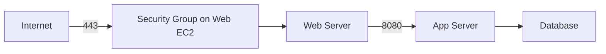

### Simple rule examples

- allow inbound TCP 80 and 443 from the internet to the web tier
- allow inbound TCP 8080 from web tier to app tier
- allow outbound to database port 3306 only from the app tier
- deny anything else by default

Security groups are a powerful and simple tool for enforcing least privilege.

---

## 9. Network ACLs (NACLs)

A Network Access Control List is a subnet-level firewall.

### What it does

- applies to all traffic entering or leaving a subnet
- works at the subnet boundary
- is stateless
- supports allow and deny rules

### Key difference from security groups

- security group = resource-level, stateful
- NACL = subnet-level, stateless

### Example

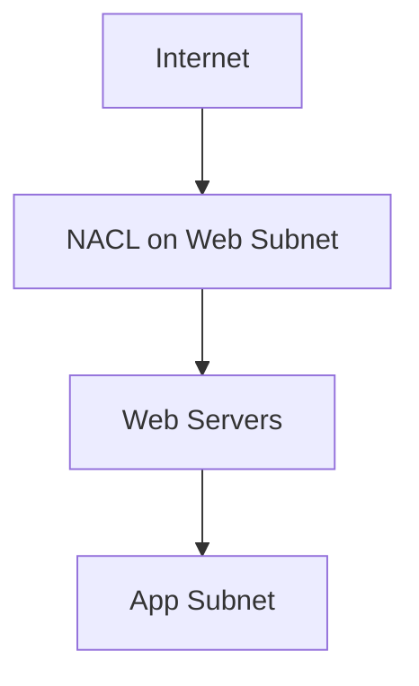

### Typical use

NACLs are often used as a second layer of defense, while security groups handle the day-to-day resource-level restrictions.

---

## 10. Route tables

A route table tells AWS network traffic where to go.

### What it controls

- traffic to the internet
- traffic to a peered network
- traffic to a NAT gateway
- traffic to a VPC endpoint or transit appliance

### Example

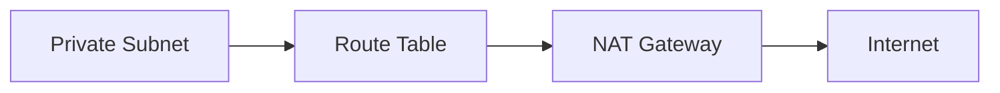

When you route traffic to a NAT Gateway or Internet Gateway, you explicitly control how private resources connect outside the VPC.

---

## 11. Public vs private networking

A big part of AWS networking is deciding whether a resource should be public or private.

### Public resources

Use public access when a resource must be reachable from the internet.

Examples:

- public application load balancer
- public web server
- internet-facing API endpoint

### Private resources

Use private access when a resource should not be exposed to the internet.

Examples:

- application servers in a private subnet
- databases in a private subnet
- internal services used only within the VPC

### Typical design

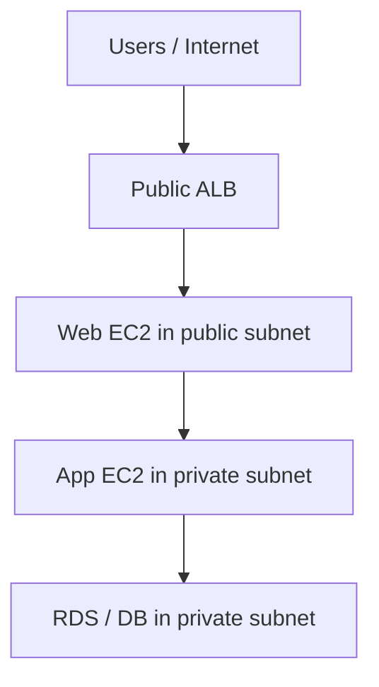

This is a very common AWS architecture: public front-end, private application and data layers.

---

## 12. Common AWS networking topologies inside one account

### Topology 1: Single VPC, multiple subnets

This is the simplest design for a small or medium application.

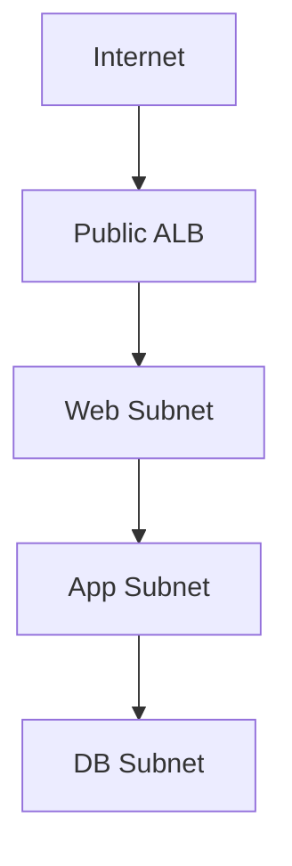

Use this when:

- you have one main application
- resources are inside one AWS account
- you want an easy starting design

---

### Topology 2: Three-tier app pattern

This is widely used for production systems.

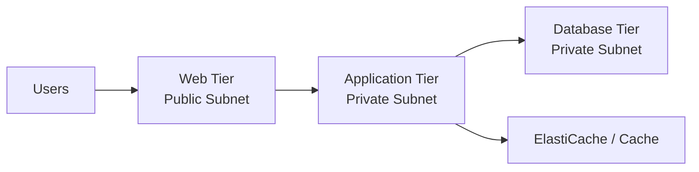

Security pattern:

- web tier is internet-facing
- application tier is private
- database tier is private
- access is tightly controlled with security groups and NACLs

---

### Topology 3: Bastion / jump host pattern

This pattern keeps admin access controlled.

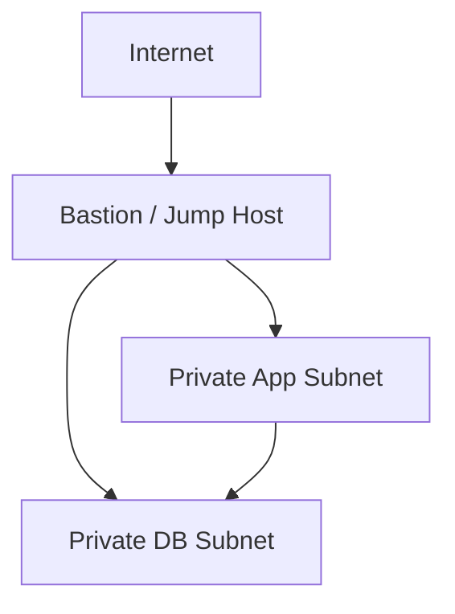

This is useful when:

- you need controlled administrative access
- you want to reduce direct internet exposure of private systems
- a small management layer is enough for your environment

---

### Topology 4: Firewall-centric model

This pattern adds a central security checkpoint.

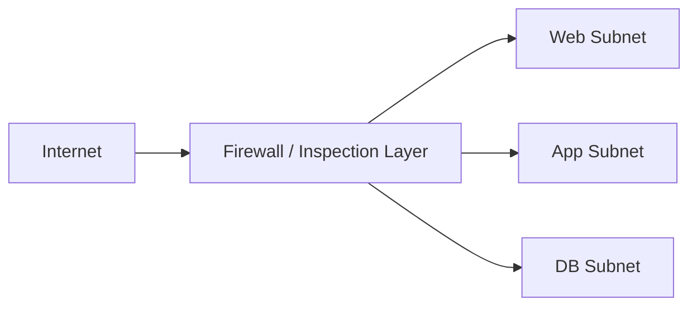

This pattern is useful when:

- traffic inspection is required
- central filtering is preferred
- more enterprise security controls are needed

---

## 13. Key networking controls to know

### Security Group
Used for instance-level traffic filtering.

### NACL
Used for subnet-level traffic filtering.

### Route Table
Used to direct traffic flows.

### Internet Gateway
Used for public internet access.

### NAT Gateway
Used for private subnet outbound access.

### Load Balancer
Used to distribute traffic across multiple targets.

### VPC Endpoint
Used to connect privately to AWS services.

### Flow Logs
Used to monitor and troubleshoot network activity.

---

## 14. Key considerations for secure AWS networking

### 1. Use least privilege
Allow only the ports and protocols actually needed.

### 2. Separate tiers
Web, app, and database workloads should not all sit in the same trust zone.

### 3. Keep private resources private
Use private subnets and NAT where possible.

### 4. Restrict public exposure
Only expose services that truly need Internet access.

### 5. Use multiple layers of control
Security groups and NACLs work together to provide defense in depth.

### 6. Plan IP ranges carefully
Avoid overlapping ranges and future design conflicts.

### 7. Monitor traffic
Use VPC flow logs and security alerts to understand what is happening.

### 8. Design for growth
Even a simple AWS VPC should be able to expand as workloads grow.

---

## 15. Example AWS account network setup

Here is a practical example of a simple application in one AWS account.

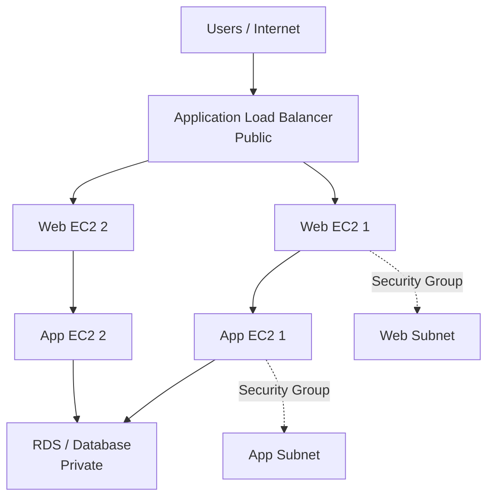

### Interpretation

- web instances are in a public-facing subnet
- app servers are private
- database is private
- traffic is controlled with security groups
- only required traffic is allowed

---

## 16. Similarities between AWS and Azure networking

The concepts are very similar, even though naming differs.

### Similarities

- both use private network boundaries
- both use subnets for segmentation
- both use security rules to filter traffic
- both support public and private network patterns
- both support load balancing and traffic routing
- both support firewall-style controls and segmentation

### Concept mapping

- AWS VPC ≈ Azure VNet
- AWS Subnet ≈ Azure Subnet
- AWS Security Group ≈ Azure NSG
- AWS Route Table ≈ Azure Route Table
- AWS Internet Gateway ≈ Azure Public IP + internet access path
- AWS NAT Gateway ≈ Azure NAT Gateway
- AWS ALB ≈ Azure Load Balancer

---

## 17. Differences between AWS and Azure networking

### 1. Terminology

AWS commonly uses VPC, Security Group, NACL, and NAT Gateway. Azure usually uses VNet, NSG, route tables, and NAT Gateway as well.

### 2. Security model style

- AWS often emphasizes security groups and subnet-level NACLs
- Azure often emphasizes NSGs, route tables, and firewall patterns plus VNet segmentation

### 3. Resource focus

AWS networking is heavily associated with VPC and EC2-based public/private patterns. Azure networking often feels more built around VNets and subnet segmentation with integrated Azure services.

### 4. Design pattern differences

Both cloud providers support similar patterns. The main difference is often the default language and the way the platform's services are exposed in the console and documentation.

---

## 18. Best practices for AWS networking inside a single account

### Keep the VPC simple first
Start with one VPC and a few subnets for the initial workload.

### Use public/private segmentation
Put only what needs to be public in public subnets.

### Enforce least privilege with security groups
Only allow required ports and sources.

### Use NACLs as a second layer of protection
Do not rely on NACLs alone for all traffic control.

### Prefer private access for internal systems
Use private subnets and VPC endpoints where appropriate.

### Monitor flows and audit changes
Use flow logs and CloudTrail-style awareness for networking review.

### Plan for future scale
Leave room for additional subnets, NAT, and load balancers as the account grows.

---

## 19. Summary

Within a single AWS account, networking is built around a VPC, subnets, routing, and security controls.

The most important idea is this:

- VPC is the private network boundary
- subnets divide it by function
- security groups control resource-level access
- NACLs control subnet-level traffic
- route tables direct traffic
- Internet Gateway and NAT handle internet connectivity
- public and private tiers separate user-facing and internal workloads

This pattern helps you design a secure and scalable AWS network without needing to think about cross-account networking at the start.

---

## 20. Final takeaway

If you are learning AWS networking, begin with one account and one VPC. Understand the VPC boundary, the purpose of subnets, and how security groups, route tables, and NAT work together. Once that foundation is clear, advanced topics such as VPC peering, transit gateways, private endpoints, and multi-account connectivity become much easier to understand.
